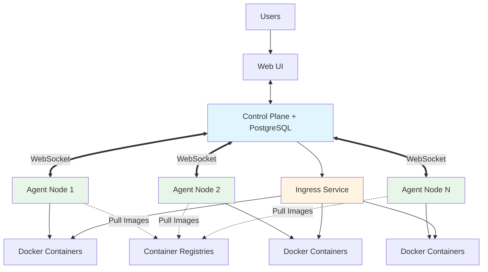
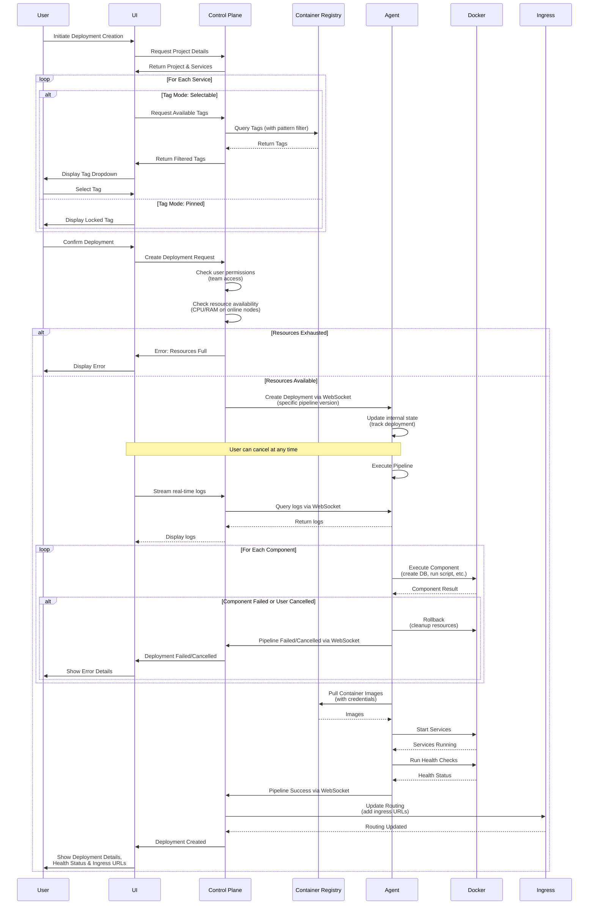

# NullOps Project Architecture

## Purpose of this project

The idea for this project came when we faced a similar challenge in our workplace.
Manual QA was always behind developers due to how complex features were and the lack of parallel testing environments.
Only one complex feature could be tested at a time.

So I've started my research. I've found several solutions, but none of them were exactly what I was looking for.

Here's a breakdown of solutions I've found:

| Solution                                      | Why it didn't work out                                                                                     |
|-----------------------------------------------|------------------------------------------------------------------------------------------------------------|
| just a k8s cluster                            | Doesn't have UI and will require DevOps engineers to create each new environment.                          |
| OpenShift                                     | Bound by corporate licenses. Lacks automation features. Complex to set up and use.                         |
| Developer Portals                             | Either require a lot of coding or paid.                                                                    |
| Manual docker-compose deployment              | Requires a developer to SSH onto target machine and manage running environments.                           |
| Automatic docker-compose deployment via CI/CD | Does not provide flexibility, complex to set up, no UI to select service versions/view active deployments. |

None of those solutions fit my needs, so I decided to create my own. An OSS platform that will allow developers to
easily create and manage their own QA environments with setup pipelines configured by DevOps engineers.

## User Roles and Access Model

### Authentication
- Local user accounts stored in PostgreSQL database
- Users authenticate with username/password
- SSO integration is planned as an after-MVP feature

### User Roles

| Role    | Description                                                                                           |
|---------|-------------------------------------------------------------------------------------------------------|
| `Admin` | DevOps engineer. Manages environments, projects, pipelines, secrets, teams, and team assignments.     |
| `User`  | Software engineer or QA engineer. Can create and manage deployments based on their team permissions. |

### Teams and Permissions

Teams are organizational units created and managed by admins. Teams provide access control to projects and environments.

**Team Access Levels:**
- **Full Access**: Can create, modify, and delete deployments. Can view logs, metrics, and configuration.
- **Read-Only**: Can view deployment status, logs, metrics, and configuration. Cannot create or modify deployments.

**Team Assignment:**
- Admins create teams (e.g., "QA Team", "Backend Team", "Frontend Team")
- Admins assign teams to projects or environments with specific access levels
- Multiple teams can be assigned to the same project/environment with different access levels
- Users are added to teams by admins
- A user's permissions are determined by their team memberships

**Example:** Admin creates "QA Team" and "SE Team". When creating a project, admin assigns "QA Team" with "Read-Only" access and "SE Team" with "Full Access". All QA team members can view deployments but only SE team members can create and manage them.

## Domain-specific terms

| Term               | Description                                                                                                                                                                      |
|--------------------|----------------------------------------------------------------------------------------------------------------------------------------------------------------------------------|
| Environment        | A Docker/k8s cluster with several deployment nodes. Has default auto-cleanup settings.                                                                                           |
| Service            | A service configuration. Defines container registry, image name, and version tag mode (pinned or selectable).                                                                    |
| Project            | A pipeline of services and components that create a deployable set. Describes required services, databases scripts and checks that are required to get a working QA environment. |
| Deployment         | A project that has been deployed to the environment. Includes its own ingress to access services inside the project.                                                             |
| Component          | Extendable action in pipeline. Examples would be: "Create DB", "Execute SQL script", "Create Keycloak user" and etc.                                                             |
| Team               | A group of users with shared access to projects or environments. Created and managed by admins.                                                                                  |
| Agent              | API service running on deployment nodes. Maintains internal state of deployments on that node and executes pipelines.                                                            |
| Container Registry | Docker registry configured by admins. Can be public (DockerHub) or private registries with authorization credentials.                                                            |
| Tag Mode           | Service version selection mode: either "pinned" (locked to specific tag) or "selectable" (users choose from pattern-matched tags).                                               |

## Architecture and expected use-case

DevOps engineer (Admin) will define services and a project. Create secrets and build a pipeline for a said project.
Pipeline describes what services to run and in what order and what actions to perform in between.
Each project describes restrictions on RAM and CPU time.

Admin creates teams and assigns team access to projects or environments with appropriate permission levels.

Then a software engineer (User with Full Access) creates a deployment for a project and selects service versions for all services (unless restricted by DevOps).
First our service checks if there are enough resources in the environment (on any of the nodes).
If resources are exhausted, the user receives an error and deployment is not created.
If resources are available, this will trigger the pipeline and deploy the project to the environment.

Later the software engineer can access the project's services via ingress at `http://servicename.deploymentname.envname.ingress.lan`.
Or provide the QA engineer with a link to UI.

When deployment is no longer needed, a user with Full Access can delete it. This will trigger automatic cleanup of the environment.

## System Component Interaction



**Component Communication:**

| From | To | Purpose |
|------|-----|---------|
| Users | UI | User interactions and deployment management |
| UI | Control Plane | API calls for all operations |
| Control Plane | Agents | Persistent WebSocket connection for commands and status queries |
| Control Plane | Ingress | Dynamic routing configuration updates |
| Agents | Docker Containers | Manage and monitor local deployments |
| Agents | Container Registries | Pull images with credentials |
| Ingress | Docker Containers | Route external traffic to services |

**Note**: Control plane and agents communicate via persistent WebSocket connections. If connection drops, agent is considered offline and control plane continuously attempts reconnection until agent is disabled by admin.

## Deployment Creation Flow



## Resource Management

### Allocation and Limits
- Each project defines CPU and RAM restrictions that apply to all its deployments
- Before creating a deployment, the control plane checks if any online node in the environment has sufficient resources
- Resource checks include both allocated resources and actual OS-level resource consumption
- If resources are exhausted, deployment creation fails immediately with an error message
- Users do not see available resources unless deployment creation fails

### Resource Monitoring
- **OS-Level Monitoring**: Agents monitor actual resource consumption from the operating system
- **Docker Limits**: Docker enforces CPU and RAM limits on running containers
- **Resource Accounting**:
    - Allocated resources tracked by control plane
    - Actual consumption monitored by agents
    - Both system resources and Docker container resources are counted
- **Resource Drift Prevention**: Docker container limits prevent processes from exceeding allocated resources

### Runtime Behavior
- Docker enforces CPU and RAM limits on running containers
- If a deployment attempts to exceed its limits, Docker prevents additional resource consumption
- Processes within the deployment cannot bypass these restrictions
- If Docker crashes and resources aren't freed properly, this is considered a user/infrastructure error

### Cleanup and Monitoring
- Agents maintain internal state of which deployments exist on their node
- Agents automatically clean up:
    - Services from deleted deployments
    - Orphaned resources (zombie deployments)
    - Resources from failed deployments after rollback
- Control plane communicates state changes to agents via WebSocket to keep internal state synchronized

## Multi-tenancy and Isolation

### Network Isolation
- Deployments are isolated from each other using network policies
- Deployments from different teams or projects cannot interfere with each other
- Inter-service communication within a single deployment is managed via Docker networks
- Central ingress service provides controlled access to deployments

### Data Isolation
- Each deployment can have its own database instance as defined by the pipeline
- Pipeline specifies which databases to spin up for the deployment
- Database connection strings are managed and injected by the pipeline configuration

### Ingress Routing
- Each service within a deployment is accessible via subdomain-based routing
- URL format example: `http://servicename.deploymentname.envname.example.com`
- **Subdomain Configuration**: Base subdomain is configurable per environment in environment settings
- **DNS Setup Required**: DevOps engineer must manually configure DNS records to point to the ingress entry point
- Ingress URLs remain stable even when deployments are recreated
- Deployments can call external APIs as needed
- Ingress configuration is dynamically updated when deployments are created or destroyed
- Control plane notifies ingress service of routing changes

## Security

### Communication Security
- **WebSocket Connections**: Control plane and agents communicate via persistent WebSocket connections
- **TLS Encryption**: All WebSocket connections use TLS encryption
- **Certificate-based Trust**:
    - Agent generates a self-signed certificate on first startup
    - Certificate thumbprint is stored in control plane database during agent registration
    - On each connection, control plane validates agent's certificate thumbprint
    - If thumbprint changes (certificate regenerated), agent is marked as untrusted
    - DevOps engineer must manually approve new thumbprint through UI before agent is trusted again

### Token Management
- **Agent Authentication Tokens**: Generated by control plane when admin adds a new node
- **Token Rotation**: Admins can rotate agent tokens through UI
    - New token is generated
    - Agent must be reconfigured with new token
    - Old token is immediately invalidated
- **Token Revocation**: Admin can revoke agent token to immediately disconnect agent
- **Token Storage**: Tokens are hashed in control plane database

### Encryption at Rest
- **Secret Encryption**: All pipeline secrets and container registry credentials are encrypted with AES-256
- **Encryption Key Management**:
    - AES encryption key is provided by DevOps engineer during control plane setup
    - Key is stored in environment variable or external Vault (after-MVP)
    - Both control plane/Vault AND database must be compromised to decrypt secrets
- **Encrypted Data**:
    - Container registry credentials
    - Pipeline secrets (passwords, API keys, connection strings)
    - Agent authentication tokens (hashed, not encrypted)

### Access Control
- User authentication via username/password stored in PostgreSQL
- Team-based permissions enforced at control plane level
- All operations are validated against user's team memberships and access levels

## Service Configuration and Container Registries

### Container Registry Management
- Admins configure available container registries through the UI
- **Default Registries**: DockerHub and other public registries are included by default
- **Private Registries**: Admins can add private registries with authorization credentials
- Credentials are securely stored and used by agents when pulling images

### Service Definition
When creating a service, admins specify:
- **Container Registry**: Which registry to use
- **Image Name**: The container image name (e.g., `postgres`, `mycompany/backend-api`)
- **Tag Mode**: How version tags are selected

### Tag Modes

**Pinned Mode:**
- Service version is locked to a specific tag
- Users cannot change the version when creating deployments
- Example use case: Databases that should always use a stable version
- UI displays the locked tag (e.g., "postgres:14.5")

**Selectable Mode:**
- Users can choose from available tags when creating deployments
- Admins can specify a pattern to filter tags (e.g., `features/*`, `v*`, `1.2.*`)
- UI displays a dropdown menu with tags pulled from the container registry
- Tags are fetched dynamically and filtered by the specified pattern
- Example: Allow selecting any feature branch tag matching `features/*`

### Version Selection Flow
1. User initiates deployment creation
2. For each service in the project:
    - If tag mode is "pinned": Display locked version, no user input
    - If tag mode is "selectable": Query container registry for available tags
3. Filter tags based on admin-defined pattern (if specified)
4. Display filtered tags in dropdown for user selection
5. User selects versions and proceeds with deployment

## Pipeline Configuration

### Pipeline Editor
- Admins configure pipelines using a UI-based node editor
- Drag-and-drop interface for adding and arranging components
- Visual connection of nodes to define execution order
- Each node represents a component (service, database, script, etc.)

### Pipeline Structure
- Nodes are connected to define dependencies and execution sequence
- Sequential execution: Components run in the order defined by connections
- Pipeline defines:
    - Which services to deploy
    - Which components to execute and when
    - Configuration for each component
    - Resource limits (CPU/RAM)

### Pipeline Execution Flow
- Agent receives pipeline definition from control plane
- Agent executes components following the node graph
- Each component must complete successfully before proceeding to next
- Any failure triggers rollback of entire pipeline

## Agent Architecture

### Agent Responsibilities
- Run as API services on each deployment node
- Maintain persisted internal state of deployments on the node
- Execute pipelines for new deployments
- Monitor and cleanup resources
- Accept and maintain persistent WebSocket connections from control plane
- Generate and manage self-signed TLS certificate

### Communication Model
- **WebSocket Connection**: Persistent, bidirectional WebSocket connection between control plane and each agent
- **Connection Initiation**: Control plane initiates WebSocket connection to agent
- **TLS Encryption**: All WebSocket connections are encrypted using TLS
- **Agent as Server**: Agent exposes WebSocket endpoint; control plane connects as client
- **Connection Lifecycle**:
    - Control plane establishes WebSocket connection to agent on agent registration
    - Connection remains open for real-time communication
    - If connection drops, control plane attempts to reconnect
    - Agent accepts reconnection attempts from control plane
- **Connection Loss Handling**:
    - Agent is marked as "offline" when WebSocket connection is lost
    - Control plane continuously attempts to restore connection
    - Reconnection attempts continue until agent is manually disabled by admin
    - When agent comes back online, state is synchronized from control plane

### Agent Health and Availability
- **Health Status**: Determined by WebSocket connection state
- **Online**: WebSocket connection is active and healthy
- **Offline**: WebSocket connection is lost or failed
- **When Agent Goes Offline**:
    - All deployments on that agent are marked as offline (not accessible)
    - Ingress is automatically reconfigured to ignore the offline node
    - Deployments are NOT migrated to other nodes
    - Deployments remain in offline state until agent reconnects
- **Version Compatibility**:
    - Control plane checks agent version on connection
    - Mixed agent versions are NOT supported
    - Agent with incompatible version is rejected and marked as incompatible

### State Management
- **Control Plane Authority**: Control plane is always the source of truth for deployment state
- **State Reconciliation**: When agent reconnects after being offline:
    - Agent receives full deployment state from control plane
    - Agent's internal state is updated to match control plane
    - Deployments are verified and restarted if necessary
- **State Corruption**: If agent's internal state becomes corrupted:
    - Only mounted volume data may be lost
    - Agent is fully reconfigured by control plane on next connection
    - Deployment state is restored from control plane database

### Internal State
- Track which deployments are active on the node
- Store deployment configurations
- Maintain pipeline execution history
- Persist state locally to survive agent restarts
- State synchronization with control plane on reconnection

## Pipeline Execution

### Component System
- Components are registered via a Plugin System
- Custom components can be added to extend pipeline functionality
- Component dependencies (Component A requiring Component B) are not supported
- Examples: "Create DB", "Execute SQL script", "Create Keycloak user"

### Plugin System
- **Packaging**: Plugins are packaged as NuGet packages
- **Storage**: Plugins are stored in an internal repository or NuGet repository
- **Configuration**: Admins configure available plugins through the UI
- **Distribution**: When plugin list changes, control plane notifies all agents via WebSocket
- **Loading**: Agents download and load plugins from the configured repository
- **Discovery**: Agents use the plugin system to discover and execute components during pipeline execution
- **Versioning**: Control plane and agents provide abstract, versioned API for plugins
- **Plugin Updates**: Updating a plugin version does not affect running deployments
- **Safety**: Agents run plugins in isolated try/catch blocks to prevent agent crashes from plugin bugs
- **Failed Downloads**: If plugin download from NuGet fails, plugin won't be loaded and components using it will fail

### Pipeline Versioning
- **Version on Save**: Each time a pipeline is modified and saved, a new version is created
- **Running Deployments**: Currently running/active deployments use the specific pipeline version they were created with
- **Immutable Versions**: Historical pipeline versions cannot be modified
- **Admin Modifications**: Admins can modify pipelines while deployments are running without affecting those deployments
- **New Deployments**: New deployments always use the latest pipeline version

### Execution Flow
- Pipelines are executed by agents on deployment nodes
- Control plane sends pipeline definition (specific version) to agent via WebSocket
- Control plane monitors pipeline execution status in real-time
- Pipeline executes components sequentially in defined order
- If any component fails, the entire pipeline fails
- Failed deployments trigger automatic rollback by the agent
- Users can retry failed deployments through the UI (uses latest pipeline version)

### Failure Handling
- Component failure = pipeline failure
- Rollback removes all resources created during the failed deployment attempt
- Agents ensure cleanup of partial deployments
- Error details are displayed to all users (admins and regular users see the same errors)
- **External Service Failures**: If container registry is unreachable or external service fails during pipeline execution, deployment fails
- **No External Databases**: External database dependencies are not supported in pipelines (or will cause pipeline failure)

## Secrets and Configuration Management

### Secret Injection
- Secrets are managed and defined in the pipeline configuration
- Pipeline specifies how secrets are injected (environment variables, Vault components, etc.)
- Admins configure secret sources and injection methods per project
- Secrets are stored in control plane database
- Agents retrieve secrets from control plane when executing pipelines

### Configuration Override
- Users can only override service versions when creating deployments (if tag mode is "selectable")
- All other configurations are locked and defined by the pipeline
- Pipeline-defined configurations include:
    - Environment variables
    - Database connection strings
    - Component parameters
    - Resource limits

## Deployment Lifecycle

### Creation and Versioning
- Users initiate deployment creation for a project
- For each service in the project:
    - **Pinned tag mode**: Version is locked, displayed but not selectable
    - **Selectable tag mode**: Users choose from available tags (filtered by pattern if specified)
- Users can only modify service versions, all other configuration is locked
- To use different versions, users must create a new deployment (versions cannot be changed after creation)
- Each deployment gets unique ingress URLs that remain stable across recreations
- Deployments use the current pipeline version at the time of creation

### Deployment Cancellation
- **In-Progress Cancellation**: Users can cancel deployments that are currently being created
- **Cancellation = Deletion**: Cancelling a deploying deployment is treated the same as deleting it
- **Rollback on Cancel**: Agent performs rollback and cleanup of partially created resources
- **Delete During Creation**: If user attempts to delete a deployment while it's being created, it is cancelled and rolled back

### Deployment Cloning
- Users can clone an existing deployment
- Cloning creates a new deployment with the same configuration
- Users can modify service versions during cloning (if tag mode is selectable)
- Cloned deployment gets new unique ingress URLs
- Cloned deployment uses the latest pipeline version (not the original deployment's pipeline version)

### Auto-cleanup Configuration
- **Environment Level**: Default auto-cleanup timer (e.g., 7 days of inactivity)
- **Project Level**: Can override environment default with project-specific timer
- Configurable per environment and overrideable per project

### Auto-cleanup Behavior
- Timer starts counting from last deployment activity
- UI displays countdown timer showing time remaining before auto-deletion
- Users with Full Access can extend deployment lifetime through UI
- **Lifetime Extension**: When user extends deployment, timer resets completely
- **Maximum Lifetime**: No hard limit on deployment lifetime (can extend indefinitely)
- System sends no additional warnings - timer in UI is the warning mechanism
- Manual deletion by users with Full Access triggers immediate cleanup
- Deployment pausing is not supported

## Observability

### Logging
- UI provides access to logs from all services within a deployment
- Control plane queries agents for service logs
- Logs are available to all users with access to the deployment (based on team permissions)

### Metrics and Health
- Health checks are visible through the UI
- Metrics are available for monitoring deployment performance and resource usage
- Agents report metrics back to control plane

### Audit and History
- Deployment history tracks who deployed what and when
- Actions are logged for audit purposes
- History is accessible through the UI based on team permissions

## Edge Cases and Failure Scenarios

### Network Connection Loss
- **During Deployment**: If WebSocket connection drops during deployment:
    - Agent is marked as offline
    - Deployment is paused in its current state
    - Agent continues attempting to complete pipeline locally
    - When connection is restored, agent reports current state to control plane
    - Control plane resumes monitoring the deployment
- **Connection Recovery**: Control plane and agent both attempt to restore connection
- **Deployment State After Recovery**: Deployment continues from where it left off

### Node Failures
- If a deployment node goes down completely, all deployments on that node are marked offline
- Ingress automatically reconfigures to remove offline node from routing
- Deployments are NOT automatically migrated to other nodes
- When node comes back online:
    - Agent reconnects to control plane
    - State is synchronized from control plane
    - Deployments are verified and services restarted if needed
    - Ingress is reconfigured to include the node again

### Node Maintenance and Decommissioning
- **Graceful Decommissioning**:
    1. Admin disables node for new deployments through UI
    2. Existing deployments continue running
    3. Admin waits for deployments to be deleted naturally or manually deletes them
    4. Once node is empty, admin can safely remove it
- **Node Reboot**:
    - Services continue running in Docker during reboot
    - Agent reconnects on startup
    - Agent re-syncs state with control plane
    - No deployment interruption if Docker services remain running
- **Future Enhancement**: Automatic deployment migration between nodes (after-MVP)

### Long-running Operations
- System supports long-running deployments and pipeline operations
- **Large Image Pulls**: If container image pull takes excessive time (30+ minutes), this is considered user error
- Users should optimize container images for reasonable pull times
- No specific timeout enforced, but extremely long operations may cause issues
- **Progress Indication**: Real-time pipeline status and logs visible in UI during long operations

### Concurrent Deployments
- Multiple users can deploy the same project simultaneously
- Each deployment is isolated and receives unique ingress URLs
- Resource availability is checked independently for each deployment request
- **Race Conditions**: If two users deploy simultaneously and resources are borderline, no special handling
    - System designed for simplicity over complex resource locking
    - One deployment may fail due to insufficient resources

### Agent Version Compatibility
- Control plane checks agent version on connection
- Mixed agent versions are NOT supported across the environment
- Agents with incompatible versions are rejected
- All agents must be upgraded together when system version changes

## Environment Scaling and Node Management

### Adding Nodes to Environment
- Admins can add new deployment nodes to an existing environment dynamically
- Nodes are manually configured by DevOps engineers through the UI
- Control plane does not automatically discover agents
- Admin provides:
    - Node hostname or IP address (where agent is accessible)
    - Agent API port
    - Authentication token for secure communication
- New nodes must be:
    - Provisioned with Docker/k8s infrastructure
    - Have agent service installed and running
    - Accessible from control plane (network connectivity)
    - Registered in the control plane via UI by admin
    - Configured with appropriate network policies for deployment isolation
- **DNS Configuration**: Admin must configure DNS for ingress subdomain to point to ingress entry point

### Agent Installation Process
1. Admin navigates to environment configuration in UI
2. Admin adds new node to the environment, providing:
    - Node hostname or IP address (where control plane can reach the agent)
    - Agent WebSocket port
    - Authentication token (generated by UI)
3. Admin spins up agent as a Docker container on the target node:
   ```bash
   docker run -d \
     -p 5000:5000 \
     -e AGENT_TOKEN=<token-from-ui> \
     -v /var/run/docker.sock:/var/run/docker.sock \
     -v /var/lib/nullops-agent:/data \
     nullops/agent:latest
   ```
4. Agent starts and generates self-signed TLS certificate (if not already present)
5. Agent exposes WebSocket endpoint and waits for control plane connection
6. Control plane initiates WebSocket connection to agent using configured hostname and port
7. Control plane authenticates using token and stores agent certificate thumbprint
8. Control plane synchronizes plugin list and deployment state with agent
9. Node becomes available for deployment allocation

**Certificate Management**:
- Agent generates self-signed certificate on first startup
- Certificate is stored in mounted volume (`/data`) and persists across restarts
- If certificate is deleted or regenerated, agent will be untrusted
- Admin must approve new certificate thumbprint through UI

**Note**: Agent does not need to know control plane URL. Agent exposes a WebSocket endpoint and control plane connects to it.

### Node Configuration in Control Plane
- Admin provides node connection details in UI:
    - Hostname or IP address (where agent is accessible)
    - Agent WebSocket port
    - Authentication token
- Control plane initiates WebSocket connection to agent endpoint
- Control plane authenticates using token and stores agent certificate thumbprint
- Control plane synchronizes plugin list and state with agent via WebSocket
- Node becomes available for deployment allocation
- **Node Disabling**: Admin can disable node to prevent new deployments while existing ones complete

## Resource Management and Quotas

### Resource Limits
- This system is designed for internal use only within an organization
- No per-user or per-team resource quotas are implemented
- No limits on concurrent deployments per user or team
- Resource availability is managed at the project level (CPU/RAM limits per deployment)
- Trust-based model: Users are expected to be responsible with resource usage

### Internal Use Scope
- System assumes a cooperative environment
- All users are internal team members
- Resource management relies on project-level restrictions and available hardware
- Fair use policies are organizational rather than system-enforced

## Future Enhancements (After-MVP)

### Planned Features
- **SSO Integration**: Support for Single Sign-On authentication providers
- **Vault Integration**: Store AES encryption key in external Vault instead of environment variable
- **Deployment Migration**: Automatically migrate deployments between nodes during maintenance
- **Deployment Diff**: Compare configuration differences between two deployments
- **Pipeline Dry-Run**: Test/validate pipelines without actually deploying
- **Advanced Monitoring and Alerting**:
    - System-wide metrics dashboard
    - Alerting when control plane or agents have issues
    - Comprehensive audit logs with detailed "who did what when"
- **Deployment Templates**: DevOps engineers can create templates for common configurations
- **Disaster Recovery**: Comprehensive backup and restore procedures for environments and deployments

## Technical Architecture Components

### Control Plane / Main Server
- Central orchestration service
- Manages users, teams, projects, environments, and container registries
- Handles authentication and authorization (local accounts)
- Maintains persistent WebSocket connections with all agents
- Monitors agent health via WebSocket connection status
- Queries agents for status, logs, and metrics via WebSocket
- Notifies ingress service of deployment changes for dynamic routing updates
- Provides API for UI
- **Data Persistence**: All state persisted to PostgreSQL database with connection pooling
- **User Management**: Stores user accounts, team memberships, and permissions
- **Configuration**: Stores projects, pipelines (with versions), environments, plugin configurations, and container registry credentials
- **Secret Management**: Securely stores and provides encrypted secrets to agents during pipeline execution
- **Certificate Management**: Stores agent certificate thumbprints for trust validation
- **Schema Management**: Automated database migrations, no manual schema changes required

### Agents
- API services running on each deployment node
- Maintain internal state of local deployments
- Execute pipelines locally
- Monitor and cleanup resources
- Maintain persistent WebSocket connection to control plane
- **Image Management**: Pull container images from configured registries using provided credentials
- **Authentication**: Validate incoming WebSocket connection using configured token
- **Certificate Management**: Generate and manage self-signed TLS certificate for secure WebSocket connection
- **Installation**: Deployed as Docker containers with generated tokens from admin UI
- **Version Compatibility**: Must match control plane version; mixed versions not supported
- **Health Reporting**: Connection status indicates agent health (online/offline)
- **State Synchronization**: Receive full state from control plane on reconnection
- **Plugin Safety**: Execute plugins in isolated try/catch blocks to prevent crashes

### Ingress Service
- Central routing for all deployment services
- Subdomain-based routing (format: `servicename.deploymentname.envname.<configured-domain>`)
- Network isolation enforcement
- **Dynamic Configuration**: Automatically reconfigures routing when deployments are created or destroyed
- Receives routing updates from control plane
- Maintains routing table for all active deployments across all online nodes
- **DNS Requirements**: DevOps engineer must configure external DNS to point subdomain to ingress entry point
- Base subdomain is configurable per environment
- **High Availability**: Hosted near control plane; HA not required for internal-use system
- Automatically removes offline nodes from routing table

### Plugin System
- Extensible component registration
- Component discovery and execution
- Used by agents to run pipeline components
- **Packaging Format**: NuGet packages
- **Repository**: Internal or external NuGet repository
- **Notification**: Control plane notifies agents via WebSocket when plugin configuration changes
- **Distribution**: Agents download plugins from configured repository on demand
- **Versioning**: Abstract versioned API between control plane/agents and plugins
- **Safety**: Plugins run in isolated environment with error handling

### UI
- Web interface for users and admins
- Displays deployment status and countdown timers
- Provides log viewing and real-time log streaming
- Allows deployment management based on permissions
- **Admin Capabilities**:
    - Configure container registries (add/remove registries, manage credentials)
    - Define services with tag modes and patterns
    - Create and edit pipelines using visual node-based editor (creates new version on save)
    - Configure plugins (add/remove NuGet packages)
    - Manage nodes and environments (including ingress subdomain configuration and DNS setup)
    - Create and manage teams
    - Assign team permissions to projects/environments
    - Generate and rotate agent authentication tokens
    - Approve agent certificate thumbprints after certificate changes
    - Configure node connection details (hostname, port, token, WebSocket URL)
    - Disable/enable nodes for maintenance
- **User Capabilities**:
    - Create deployments with service version selection
    - Clone existing deployments with version modifications
    - View deployment status, logs, metrics, and health checks
    - Cancel in-progress deployments
    - Delete deployments (with Full Access permission)
    - Extend deployment lifetime before auto-cleanup