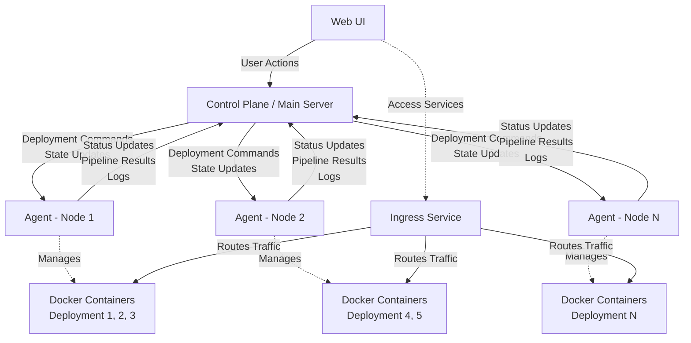
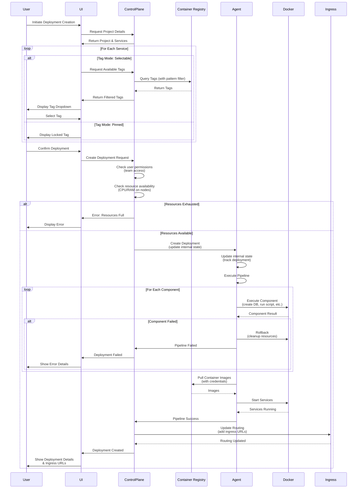

# NullOps Project Architecture

## Purpose of this project

The idea for this project came when we faced a similar challenge in our workplace.
Manual QA was always behind developers due to how complex features were and the lack of parallel testing environments.
Only one complex feature could be tested at a time.

So I've started my research. I've found several solutions, but none of them were exactly what I was looking for.

Here's a breakdown of solutions I've found:

| Solution                                      | Why it didn't work out                                                                                     |
|-----------------------------------------------|------------------------------------------------------------------------------------------------------------|
| just a k8s cluster                            | Doesn't have UI and will require DevOps engineers to create each new environment.                          |
| OpenShift                                     | Bound by corporate licenses. Lacks automation features. Complex to set up and use.                         |
| Developer Portals                             | Either require a lot of coding or paid.                                                                    |
| Manual docker-compose deployment              | Requires a developer to SSH onto target machine and manage running environments.                           |
| Automatic docker-compose deployment via CI/CD | Does not provide flexibility, complex to set up, no UI to select service versions/view active deployments. |

None of those solutions fit my needs, so I decided to create my own. An OSS platform that will allow developers to
easily create and manage their own QA environments with setup pipelines configured by DevOps engineers.

## User Roles and Access Model

### Authentication
- Local user accounts stored in PostgreSQL database
- Users authenticate with username/password
- SSO integration is planned as an after-MVP feature

### User Roles

| Role    | Description                                                                                           |
|---------|-------------------------------------------------------------------------------------------------------|
| `Admin` | DevOps engineer. Manages environments, projects, pipelines, secrets, teams, and team assignments.     |
| `User`  | Software engineer or QA engineer. Can create and manage deployments based on their team permissions. |

### Teams and Permissions

Teams are organizational units created and managed by admins. Teams provide access control to projects and environments.

**Team Access Levels:**
- **Full Access**: Can create, modify, and delete deployments. Can view logs, metrics, and configuration.
- **Read-Only**: Can view deployment status, logs, metrics, and configuration. Cannot create or modify deployments.

**Team Assignment:**
- Admins create teams (e.g., "QA Team", "Backend Team", "Frontend Team")
- Admins assign teams to projects or environments with specific access levels
- Multiple teams can be assigned to the same project/environment with different access levels
- Users are added to teams by admins
- A user's permissions are determined by their team memberships

**Example:** Admin creates "QA Team" and "SE Team". When creating a project, admin assigns "QA Team" with "Read-Only" access and "SE Team" with "Full Access". All QA team members can view deployments but only SE team members can create and manage them.

## Domain-specific terms

| Term               | Description                                                                                                                                                                      |
|--------------------|----------------------------------------------------------------------------------------------------------------------------------------------------------------------------------|
| Environment        | A Docker/k8s cluster with several deployment nodes. Has default auto-cleanup settings.                                                                                           |
| Service            | A service configuration. Defines container registry, image name, and version tag mode (pinned or selectable).                                                                    |
| Project            | A pipeline of services and components that create a deployable set. Describes required services, databases scripts and checks that are required to get a working QA environment. |
| Deployment         | A project that has been deployed to the environment. Includes its own ingress to access services inside the project.                                                             |
| Component          | Extendable action in pipeline. Examples would be: "Create DB", "Execute SQL script", "Create Keycloak user" and etc.                                                             |
| Team               | A group of users with shared access to projects or environments. Created and managed by admins.                                                                                  |
| Agent              | API service running on deployment nodes. Maintains internal state of deployments on that node and executes pipelines.                                                            |
| Container Registry | Docker registry configured by admins. Can be public (DockerHub) or private registries with authorization credentials.                                                            |
| Tag Mode           | Service version selection mode: either "pinned" (locked to specific tag) or "selectable" (users choose from pattern-matched tags).                                               |

## Architecture and expected use-case

DevOps engineer (Admin) will define services and a project. Create secrets and build a pipeline for a said project.
Pipeline describes what services to run and in what order and what actions to perform in between.
Each project describes restrictions on RAM and CPU time.

Admin creates teams and assigns team access to projects or environments with appropriate permission levels.

Then a software engineer (User with Full Access) creates a deployment for a project and selects service versions for all services (unless restricted by DevOps).
First our service checks if there are enough resources in the environment (on any of the nodes).
If resources are exhausted, the user receives an error and deployment is not created.
If resources are available, this will trigger the pipeline and deploy the project to the environment.

Later the software engineer can access the project's services via ingress at `http://servicename.deploymentname.envname.ingress.lan`.
Or provide the QA engineer with a link to UI.

When deployment is no longer needed, a user with Full Access can delete it. This will trigger automatic cleanup of the environment.

## System Component Interaction



## Deployment Creation Flow



## Resource Management

### Allocation and Limits
- Each project defines CPU and RAM restrictions that apply to all its deployments
- Before creating a deployment, the control plane checks if any node in the environment has sufficient resources
- If resources are exhausted, deployment creation fails immediately with an error message
- Users do not see available resources unless deployment creation fails

### Runtime Behavior
- Docker enforces CPU and RAM limits on running containers
- If a deployment attempts to exceed its limits, Docker prevents additional resource consumption
- Processes within the deployment cannot bypass these restrictions

### Cleanup and Monitoring
- Agents maintain internal state of which deployments exist on their node
- Agents automatically clean up:
    - Services from deleted deployments
    - Orphaned resources (zombie deployments)
    - Resources from failed deployments after rollback
- Control plane communicates state changes to agents to keep internal state synchronized

## Multi-tenancy and Isolation

### Network Isolation
- Deployments are isolated from each other using network policies
- Deployments from different teams or projects cannot interfere with each other
- Inter-service communication within a single deployment is managed via Docker networks
- Central ingress service provides controlled access to deployments

### Data Isolation
- Each deployment can have its own database instance as defined by the pipeline
- Pipeline specifies which databases to spin up for the deployment
- Database connection strings are managed and injected by the pipeline configuration

### Ingress Routing
- Each service within a deployment is accessible via subdomain-based routing
- URL format: `http://servicename.deploymentname.envname.ingress.lan`
- Ingress URLs remain stable even when deployments are recreated
- Deployments can call external APIs as needed
- Ingress configuration is dynamically updated when deployments are created or destroyed
- Control plane notifies ingress service of routing changes

## Service Configuration and Container Registries

### Container Registry Management
- Admins configure available container registries through the UI
- **Default Registries**: DockerHub and other public registries are included by default
- **Private Registries**: Admins can add private registries with authorization credentials
- Credentials are securely stored and used by agents when pulling images

### Service Definition
When creating a service, admins specify:
- **Container Registry**: Which registry to use
- **Image Name**: The container image name (e.g., `postgres`, `mycompany/backend-api`)
- **Tag Mode**: How version tags are selected

### Tag Modes

**Pinned Mode:**
- Service version is locked to a specific tag
- Users cannot change the version when creating deployments
- Example use case: Databases that should always use a stable version
- UI displays the locked tag (e.g., "postgres:14.5")

**Selectable Mode:**
- Users can choose from available tags when creating deployments
- Admins can specify a pattern to filter tags (e.g., `features/*`, `v*`, `1.2.*`)
- UI displays a dropdown menu with tags pulled from the container registry
- Tags are fetched dynamically and filtered by the specified pattern
- Example: Allow selecting any feature branch tag matching `features/*`

### Version Selection Flow
1. User initiates deployment creation
2. For each service in the project:
    - If tag mode is "pinned": Display locked version, no user input
    - If tag mode is "selectable": Query container registry for available tags
3. Filter tags based on admin-defined pattern (if specified)
4. Display filtered tags in dropdown for user selection
5. User selects versions and proceeds with deployment

## Pipeline Configuration

### Pipeline Editor
- Admins configure pipelines using a UI-based node editor
- Drag-and-drop interface for adding and arranging components
- Visual connection of nodes to define execution order
- Each node represents a component (service, database, script, etc.)

### Pipeline Structure
- Nodes are connected to define dependencies and execution sequence
- Sequential execution: Components run in the order defined by connections
- Pipeline defines:
    - Which services to deploy
    - Which components to execute and when
    - Configuration for each component
    - Resource limits (CPU/RAM)

### Pipeline Execution Flow
- Agent receives pipeline definition from control plane
- Agent executes components following the node graph
- Each component must complete successfully before proceeding to next
- Any failure triggers rollback of entire pipeline

## Agent Architecture

### Agent Responsibilities
- Run as API services on each deployment node
- Maintain persisted internal state of deployments on the node
- Execute pipelines for new deployments
- Monitor and cleanup resources
- Respond to control plane queries for status and logs

### Communication Model
- Control plane sends deployment commands and state updates to agents
- Control plane queries agents for:
    - Pipeline execution status
    - Deployment status
    - Service logs
    - Resource usage
- Agents report back status, results, and logs to control plane
- Agents work semi-autonomously based on their internal state

### Internal State
- Track which deployments are active on the node
- Store deployment configurations
- Maintain pipeline execution history
- Persist state locally to survive agent restarts
- State synchronization with control plane after restart

## Pipeline Execution

### Component System
- Components are registered via a Plugin System
- Custom components can be added to extend pipeline functionality
- Component dependencies (Component A requiring Component B) are not supported
- Examples: "Create DB", "Execute SQL script", "Create Keycloak user"

### Plugin System
- **Packaging**: Plugins are packaged as NuGet packages
- **Storage**: Plugins are stored in an internal repository or NuGet repository
- **Configuration**: Admins configure available plugins through the UI
- **Distribution**: When plugin list changes, control plane notifies all agents
- **Loading**: Agents download and load plugins from the configured repository
- **Discovery**: Agents use the plugin system to discover and execute components during pipeline execution

### Execution Flow
- Pipelines are executed by agents on deployment nodes
- Control plane queries agents for pipeline execution status
- Pipeline executes components sequentially in defined order
- If any component fails, the entire pipeline fails
- Failed deployments trigger automatic rollback by the agent
- Users can retry failed deployments through the UI

### Failure Handling
- Component failure = pipeline failure
- Rollback removes all resources created during the failed deployment attempt
- Agents ensure cleanup of partial deployments
- Error details are displayed to all users (admins and regular users see the same errors)

## Secrets and Configuration Management

### Secret Injection
- Secrets are managed and defined in the pipeline configuration
- Pipeline specifies how secrets are injected (environment variables, Vault components, etc.)
- Admins configure secret sources and injection methods per project
- Secrets are stored in control plane database
- Agents retrieve secrets from control plane when executing pipelines

### Configuration Override
- Users can only override service versions when creating deployments (if tag mode is "selectable")
- All other configurations are locked and defined by the pipeline
- Pipeline-defined configurations include:
    - Environment variables
    - Database connection strings
    - Component parameters
    - Resource limits

## Deployment Lifecycle

### Creation and Versioning
- Users initiate deployment creation for a project
- For each service in the project:
    - **Pinned tag mode**: Version is locked, displayed but not selectable
    - **Selectable tag mode**: Users choose from available tags (filtered by pattern if specified)
- Users can only modify service versions, all other configuration is locked
- To use different versions, users must create a new deployment (versions cannot be changed after creation)
- Each deployment gets unique ingress URLs that remain stable across recreations

### Auto-cleanup Configuration
- **Environment Level**: Default auto-cleanup timer (e.g., 7 days of inactivity)
- **Project Level**: Can override environment default with project-specific timer
- Configurable per environment and overrideable per project

### Auto-cleanup Behavior
- Timer starts counting from last deployment activity
- UI displays countdown timer showing time remaining before auto-deletion
- Users with Full Access can extend deployment lifetime through UI
- System sends no additional warnings - timer in UI is the warning mechanism
- Manual deletion by users with Full Access triggers immediate cleanup
- Deployment pausing is not supported

## Observability

### Logging
- UI provides access to logs from all services within a deployment
- Control plane queries agents for service logs
- Logs are available to all users with access to the deployment (based on team permissions)

### Metrics and Health
- Health checks are visible through the UI
- Metrics are available for monitoring deployment performance and resource usage
- Agents report metrics back to control plane

### Audit and History
- Deployment history tracks who deployed what and when
- Actions are logged for audit purposes
- History is accessible through the UI based on team permissions

## Edge Cases and Failure Scenarios

### Node Failures
- If a deployment node goes down mid-deployment, the deployment fails
- Failed deployment triggers rollback via agent on remaining nodes (if applicable)
- Future consideration: investigate graceful handling and potential recovery mechanisms

### Long-running Deployments
- System supports long-running deployments (e.g., hours for large data imports)
- Timeout handling to be defined by pipeline configuration

### Concurrent Deployments
- Multiple users can deploy the same project simultaneously
- Each deployment is isolated and receives unique ingress URLs
- Resource availability is checked independently for each deployment request

## Environment Scaling and Node Management

### Adding Nodes to Environment
- Admins can add new deployment nodes to an existing environment dynamically
- Nodes are manually configured by DevOps engineers through the UI
- Control plane does not automatically discover agents
- New nodes must be:
    - Provisioned with Docker/k8s infrastructure
    - Have agent service installed and running
    - Registered in the control plane via UI by admin
    - Configured with appropriate network policies and ingress routing

### Agent Installation Process
1. Admin navigates to environment configuration in UI
2. UI generates a unique authentication token for the new agent
3. Admin retrieves the token from UI
4. Admin spins up agent as a Docker container on the target node:
   ```bash
   docker run -d \
     -e AGENT_TOKEN=<token-from-ui> \
     -v /var/run/docker.sock:/var/run/docker.sock \
     <container-image-name>
   ```
5. Agent authenticates with control plane using the token
6. Control plane registers the agent and synchronizes configuration

### Node Configuration
- Admin provides node connection details in UI
- Control plane establishes connection with new agent
- Agent synchronizes plugin list from control plane
- Node becomes available for deployment allocation

## Resource Management and Quotas

### Resource Limits
- This system is designed for internal use only within an organization
- No per-user or per-team resource quotas are implemented
- No limits on concurrent deployments per user or team
- Resource availability is managed at the project level (CPU/RAM limits per deployment)
- Trust-based model: Users are expected to be responsible with resource usage

### Internal Use Scope
- System assumes a cooperative environment
- All users are internal team members
- Resource management relies on project-level restrictions and available hardware
- Fair use policies are organizational rather than system-enforced

## Future Enhancements (After-MVP)

### Planned Features
- **SSO Integration**: Support for Single Sign-On authentication providers
- **Disaster Recovery**: Backup and restore procedures for environments and deployments
- **Automatic Node Discovery**: Control plane automatically discovers and registers new agents
- **Advanced Monitoring**: Enhanced metrics and alerting capabilities

## Technical Architecture Components

### Control Plane / Main Server
- Central orchestration service
- Manages users, teams, projects, environments, and container registries
- Handles authentication and authorization (local accounts)
- Communicates with agents to manage deployments
- Queries agents for status, logs, and metrics
- Notifies ingress service of deployment changes for dynamic routing updates
- Provides API for UI
- **Data Persistence**: All state persisted to PostgreSQL database
- **User Management**: Stores user accounts, team memberships, and permissions
- **Configuration**: Stores projects, pipelines, environments, plugin configurations, and container registry credentials
- **Secret Management**: Securely stores and provides secrets to agents during pipeline execution

### Agents
- API services running on each deployment node
- Maintain internal state of local deployments
- Execute pipelines locally
- Monitor and cleanup resources
- Report status and logs to control plane
- **Image Management**: Pull container images from configured registries using provided credentials
- **Authentication**: Use token-based authentication with control plane
- **Installation**: Deployed as Docker containers with generated tokens from admin UI

### Ingress Service
- Central routing for all deployment services
- Subdomain-based routing (`servicename.deploymentname.envname.ingress.lan`)
- Network isolation enforcement
- **Dynamic Configuration**: Automatically reconfigures routing when deployments are created or destroyed
- Receives routing updates from control plane
- Maintains routing table for all active deployments across all nodes

### Plugin System
- Extensible component registration
- Component discovery and execution
- Used by agents to run pipeline components
- **Packaging Format**: NuGet packages
- **Repository**: Internal or external NuGet repository
- **Notification**: Control plane notifies agents when plugin configuration changes
- **Distribution**: Agents download plugins from configured repository on demand

### UI
- Web interface for users and admins
- Displays deployment status and countdown timers
- Provides log viewing
- Allows deployment management based on permissions
- **Admin Capabilities**:
    - Configure container registries (add/remove registries, manage credentials)
    - Define services with tag modes and patterns
    - Create and edit pipelines using visual node-based editor
    - Configure plugins (add/remove NuGet packages)
    - Manage nodes and environments
    - Create and manage teams
    - Assign team permissions to projects/environments
    - Generate agent authentication tokens
- **User Capabilities**:
    - Create deployments with service version selection
    - View deployment status, logs, and metrics
    - Delete deployments (with Full Access permission)
    - Extend deployment lifetime before auto-cleanup